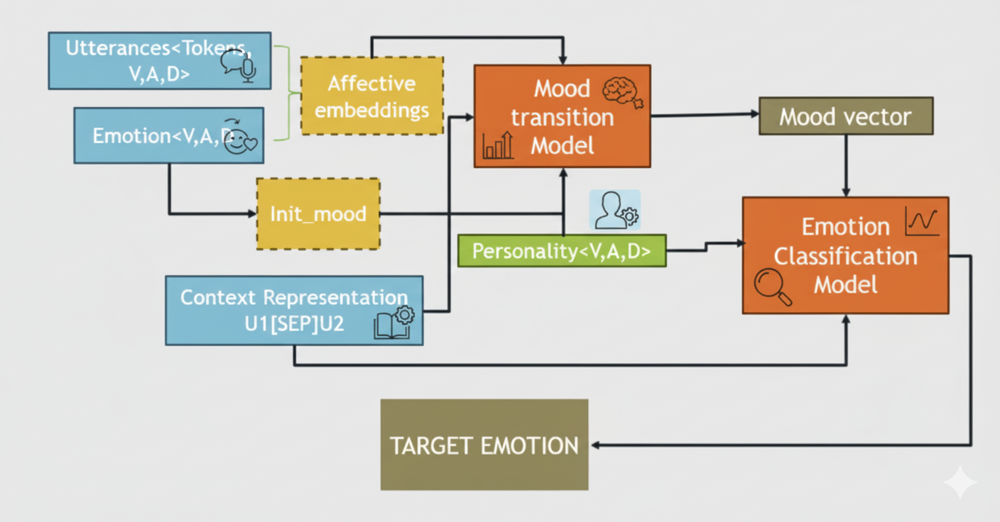

# Deep Learning Sentiment Prediction

## 🤔 U might be wondering how this is different from other sentiment prediction models...
Most sentiment models just look at the *text in isolation*. Our model goes a step further—it mixes **personality traits, mood dynamics, and context flow** to predict emotions.  
Think of it like this: instead of just saying "that sentence sounds sad," we also ask: *"but would THIS person, with THIS personality, in THIS conversation, really express it that way?"*  
That’s how we make predictions feel more human-like and consistent across dialogue.

---

## 🧩 What We Built
- Uses the **PELD dataset** (Friends TV series dialogues + personality vectors).  
- Encodes **utterances in Valence–Arousal–Dominance (VAD) space**.  
- Integrates **OCEAN personality traits** (Openness, Conscientiousness, Extraversion, Agreeableness, Neuroticism).  
- Models **mood transitions** over conversations instead of treating emotions as isolated snapshots.  
- Predicts emotions from 7 classes: *neutral, joy, surprise, anger, fear, sadness, disgust*.  

---

## 🏗️ Architecture
Here’s the high-level architecture we designed:  



---

## 🚀 Models Tried
We experimented with multiple architectures:
- **BERT + BiGRU** → contextual embeddings + personality fusion  
- **Graph Neural Network (GNN)** → captured conversation flow + traits  
- **Temporal Convolutional Network (TCN)** → best overall performer!  
- **HTN + GRU, Autoencoders, Multi-head Attention** → explored trade-offs in accuracy vs. generalization  

---

## 📊 Results
- **Best Model**: Temporal Convolutional Network (TCN)  
- **Macro-F1**: 0.43 | **Micro-F1**: 0.55  
- Strongest at predicting *Neutral, Joy, and Anger*, while still improving on rare classes like *Disgust* and *Surprise*.  

---

## 📦 How to Run
1. Clone this repo:  
   ```bash
   git clone https://github.com/your-username/deep-learning-sentiment.git
   cd deep-learning-sentiment
